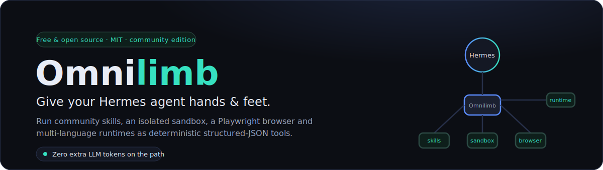
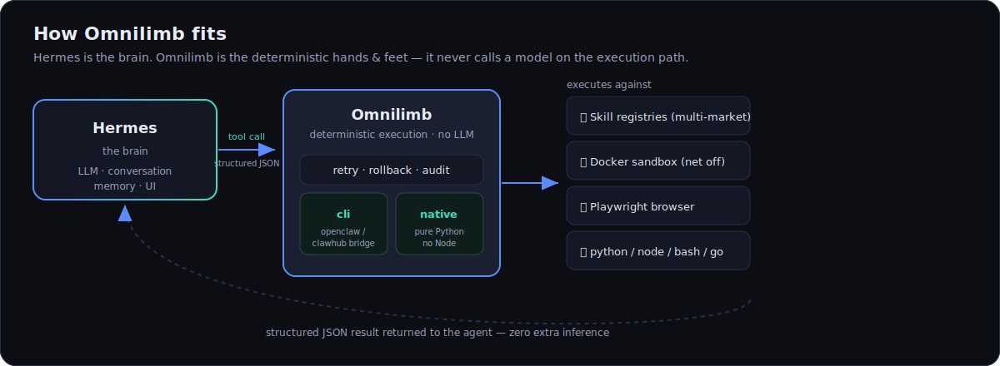
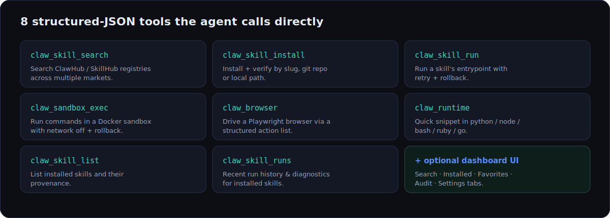
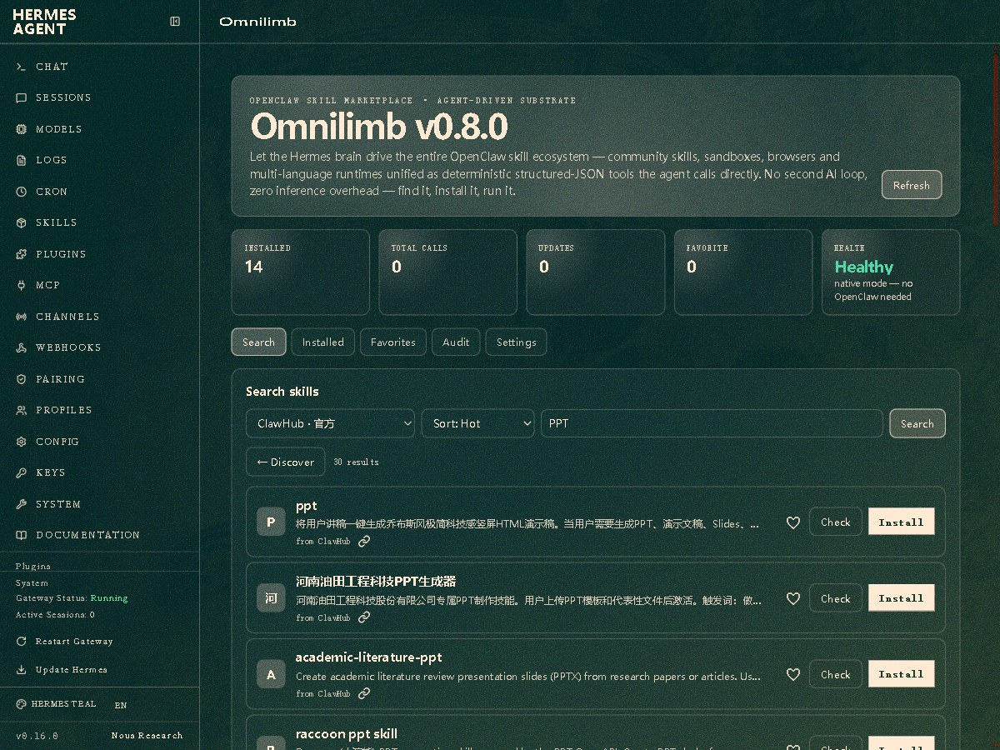
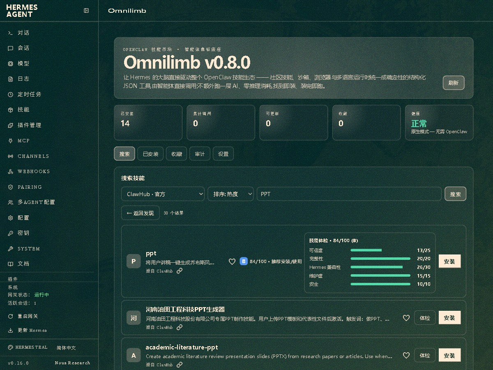
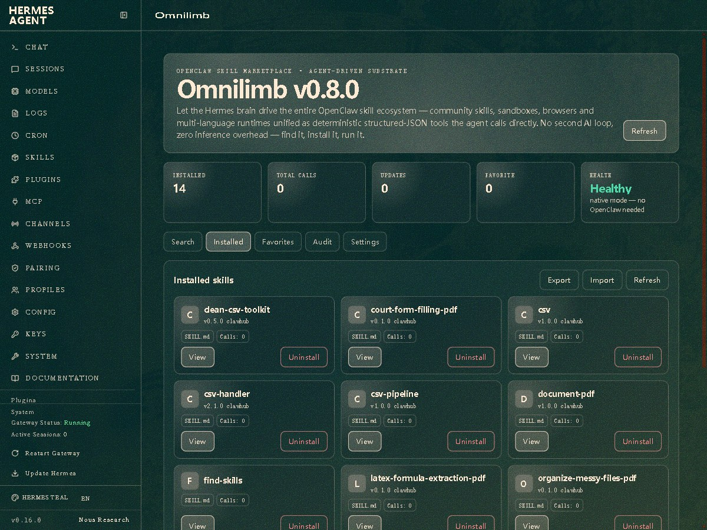

<p align="center">
  
</p>

<p align="center">
  <a href="https://pypi.org/project/omnilimb/"></a>
  <a href="LICENSE"></a>
  
  
  
  <a href="http://www.omnilimb.com"></a>
</p>

<p align="center">
  <b>English</b> · <a href="README.zh-CN.md">简体中文</a>
  &nbsp;|&nbsp; 🌐 <a href="http://www.omnilimb.com">omnilimb.com</a>
</p>

# Omnilimb

**Your Hermes agent is the brain. Omnilimb is the hands and feet.**

Omnilimb is a Hermes plugin that lets an agent *find, install, run and manage*
[OpenClaw / ClawHub](https://clawhub.ai) community skills — and gives it an
isolated sandbox, a real Playwright browser, and multi-language runtimes. Every
capability is exposed as a small, **deterministic structured-JSON tool** the
agent calls directly, so there are **zero extra LLM tokens on the execution
path** and no second "agent loop" burning your budget.

> ℹ️ Compatible with OpenClaw &amp; ClawHub; not affiliated with them.
> "Omnilimb" is an independent product ([omnilimb.com](http://www.omnilimb.com)).

---

## Why Omnilimb

- ⚡ **Zero token overhead.** The execution path never calls a model. The agent
  decides *once*; Omnilimb does the work deterministically and hands back JSON.
- 🧰 **A whole toolbox, one small surface.** Eight tools cover skill discovery,
  install, run, sandbox, browser, and runtimes — no sprawling API to learn.
- 🛡️ **Safe by default.** Third-party skills run in a Docker sandbox with the
  network off and automatic rollback. Path-traversal and zip-slip guarded.
- 🔌 **No lock-in, no phone-home.** Search talks only to the market you pick.
  Your code, caches and audit log stay on your machine.
- 🪶 **Runs with or without Node.** The `native` backend is pure Python; the
  `cli` backend bridges the real `openclaw` / `clawhub` binaries for full parity.
- 🌐 **Bring your own market.** ClawHub, SkillHub, the official China mirror, a
  GitHub index — or add your own adapter in a few lines.

<p align="center">
  
</p>

## The tools

Omnilimb registers these structured-JSON tools the agent can call:

| Tool | What it does |
|------|--------------|
| `claw_skill_search` | Search the ClawHub / SkillHub registry |
| `claw_skill_install` | Install + verify a skill (slug / `git:owner/repo@ref` / local path) |
| `claw_skill_run` | Deterministically run a skill's script entrypoint |
| `claw_sandbox_exec` | Run a command in an isolated (Docker) sandbox with rollback |
| `claw_browser` | Playwright browser automation via a structured action list |
| `claw_runtime` | Quick snippet in python / node / bash / ruby / go |
| `claw_skill_list` | List locally installed skills and their provenance |
| `claw_skill_runs` | Recent run history for installed skills (diagnostics) |

<p align="center">
  
</p>

## Quickstart

**As a pip package:**

```bash
pip install omnilimb               # core
pip install "omnilimb[browser]"    # + Playwright
playwright install chromium        # one-time browser download
hermes plugins enable omnilimb
```

**As a directory plugin (simplest):**

```bash
cp -r omnilimb ~/.hermes/plugins/omnilimb
hermes plugins enable omnilimb
```

Verify inside a session:

```
/exo doctor
```

### Try it locally — no Hermes, no GUI

The plugin is a headless engine; the way to *feel* it is to call its tools and
read the JSON they return:

```bash
python scripts/demo.py doctor                  # backend status
python scripts/demo.py search github 5         # live ClawHub search
python scripts/demo.py runtime python "print(6*7)"
python scripts/demo.py sandbox "echo hi"
python scripts/demo.py menu                    # interactive
```

## Pick your market

Switch the skills marketplace with `omnilimb.market` (or `OMNILIMB_MARKET`):

| Market | Source | Notes |
|--------|--------|-------|
| `clawhub` (default) | clawhub.ai | Official OpenClaw registry, HTTP API v1 |
| `skillhub` | api.skillhub.cn | China-focused market; server-side search, public zip download |
| `clawhub-cn` | mirror-cn.clawhub.com | Official China mirror (Volcengine) |
| `skillsmp` | skillsmp.com | GitHub-hosted skill index |

Add more under `omnilimb.markets` in `~/.hermes/config.yaml` (each is
`{id, type, base_url, label}` where `type` is one of
`clawhub | skillhub | clawhub_mirror | skillsmp`). A new adapter class in
`omnilimb/registries.py` is all it takes to support a new kind of market.

## Pick your backend

Set `omnilimb.backend` in `~/.hermes/config.yaml` (or `OMNILIMB_BACKEND`):

| Mode | Behaviour |
|------|-----------|
| `cli` | Bridges to the real `openclaw` / `clawhub` CLIs. Best registry parity. Requires Node + OpenClaw. |
| `native` | Fully decoupled Python substrate. No Node. Handles sandbox/browser/runtime + `git:`/local skill installs natively. |
| `auto` (default) | `cli` if the `openclaw` binary is on PATH, else `native`. |

## Dashboard UI (optional)

A dependency-free web UI ships in `dashboard/` for the Hermes dashboard. After
enabling the plugin and restarting `hermes dashboard`, an **Omnilimb** tab
appears (after *Skills*) with:

- **Search** — discovery across markets (leaderboards, categories) + a per-skill
  health check (体检).
- **Installed** — view/edit `SKILL.md`, run, smoke-test, manage credentials,
  check readiness, import/export, uninstall.
- **Favorites** — bookmarked skills.
- **Audit** — the optional JSONL audit log.
- **Settings** — backend / market / cache / paths + diagnostics.

The UI follows the active dashboard theme and language automatically.

### See it in action

Live skill search, a one-click **health check (体检)** with a transparent 0–100
score, and installed-skill management — all in the dashboard tab (click to enlarge):

<table>
<tr>
<td width="33%" valign="top"><a href="docs/assets/ui-search.jpg"></a><br/><sub><b>Search</b> — live ClawHub results for “PPT”.</sub></td>
<td width="33%" valign="top"><a href="docs/assets/ui-healthcheck.jpg"></a><br/><sub><b>Health check</b> — transparent 0–100 score.</sub></td>
<td width="33%" valign="top"><a href="docs/assets/ui-installed.jpg"></a><br/><sub><b>Installed</b> — manage everything you’ve added.</sub></td>
</tr>
</table>

> 🌐 Project site: **[omnilimb.com](http://www.omnilimb.com)**

## Configure (`~/.hermes/config.yaml`)

```yaml
omnilimb:
  backend: auto            # auto | cli | native
  market: clawhub          # clawhub | skillhub | clawhub-cn | skillsmp
  sandbox_enabled: true
  sandbox_image: "python:3.12-slim"
  sandbox_network: false
  default_timeout_s: 120
  max_retries: 2
  rollback: true
  registry_base_url: "https://clawhub.ai"
  browser_headless: true
  audit_log: false         # write a JSONL audit log of tool calls
  cache_enabled: true      # local SQLite cache for discovery + search fallback
  discover_ttl_s: 21600    # discovery leaderboard cache TTL (6h)
  cache_max_age_s: 604800  # max staleness for offline search fallback (7d)
```

Settings changed from the dashboard's **Settings** tab are written to a separate
overrides file (`omnilimb.overrides.json`), never to your hand-authored
`config.yaml`. Resolution order is `env > overrides > config.yaml`.

## Security

Third-party skills are untrusted code. Prefer `claw_sandbox_exec` with
`network: false` for anything you don't fully trust. Without Docker, sandbox
calls run locally and are flagged `"sandboxed": false`. Skill file operations
and uninstall are path-traversal guarded; archive extraction is zip-slip
protected. See [`SECURITY.md`](SECURITY.md) to report a vulnerability.

## Development

```bash
pip install -e ".[dev,browser]"
pytest -q
```

See [`CONTRIBUTING.md`](CONTRIBUTING.md) for the architecture rules (the plugin
never imports or modifies Hermes core, every handler returns JSON and never
raises) and how to add a market or backend.

## License &amp; editions

> **This is an early test / community edition, licensed under MIT — free to use.
> A future stable version will adopt an AGPLv3 + commercial dual-license; please
> plan accordingly.**

This repository contains the **free community edition** only. It is feature-
complete for finding, installing, running, and managing OpenClaw / ClawHub
skills locally. Commercial/Pro capabilities (skill → native Hermes conversion,
AI curation, curated packs, auto-update, assistant console) are **not** part of
this edition and are planned for a future Pro release under a separate license.

MIT — see [`LICENSE`](LICENSE). Not affiliated with OpenClaw / ClawHub.
