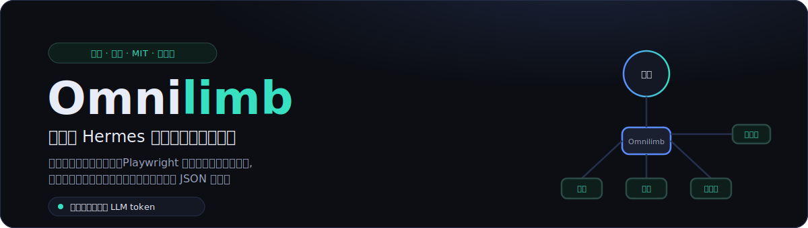
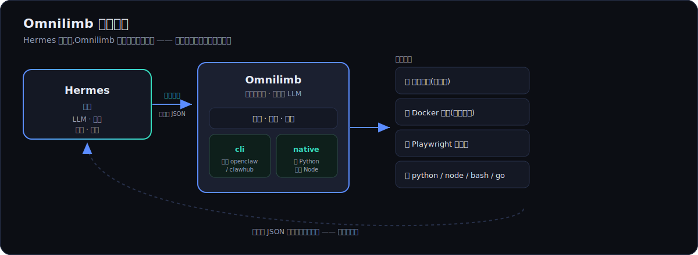
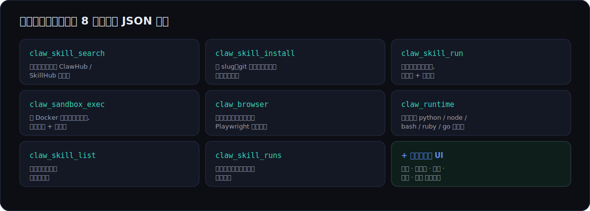
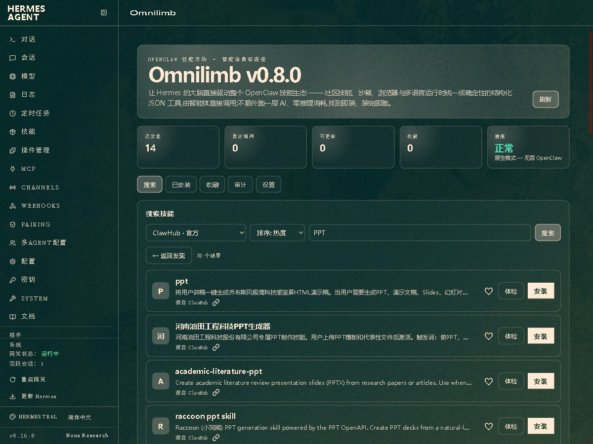
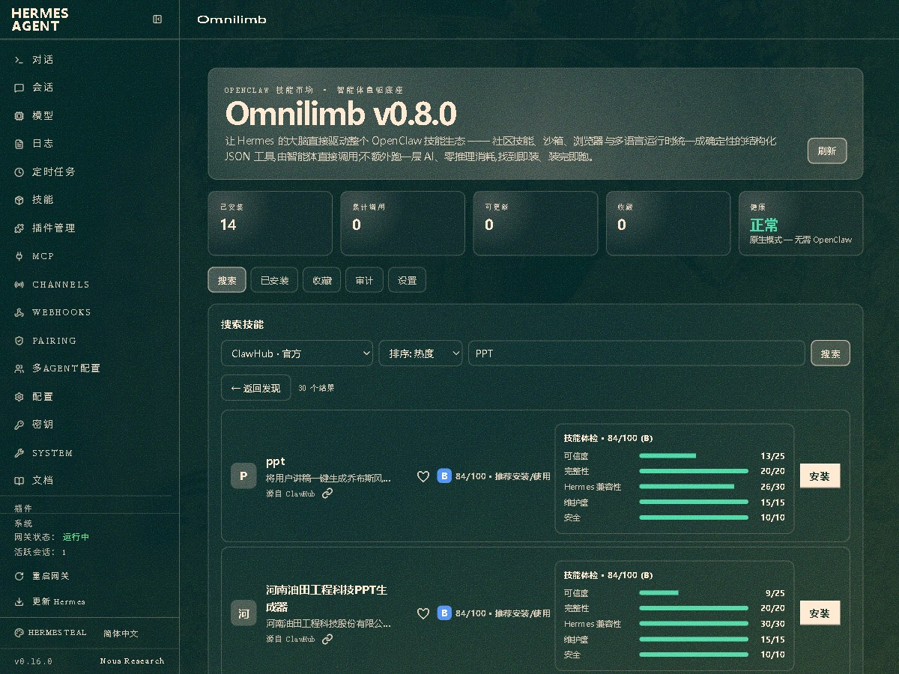
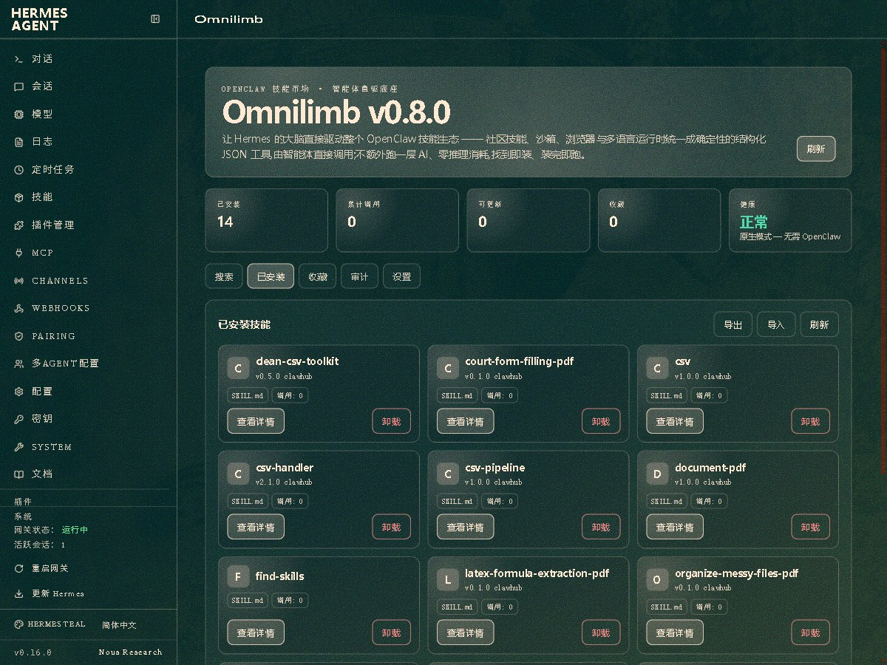

<p align="center">
  
</p>

<p align="center">
  <a href="https://pypi.org/project/omnilimb/"></a>
  <a href="LICENSE"></a>
  
  
  
  <a href="http://www.omnilimb.com"></a>
</p>

<p align="center">
  <a href="README.md">English</a> · <b>简体中文</b>
  &nbsp;|&nbsp; 🌐 <a href="http://www.omnilimb.com">omnilimb.com</a>
</p>

# Omnilimb

**你的 Hermes 智能体是大脑,Omnilimb 是它的手和脚。**

Omnilimb 是一个 Hermes 插件,让智能体能够*查找、安装、运行和管理*
[OpenClaw / ClawHub](https://clawhub.ai) 社区技能,还为它配上隔离沙箱、真实的
Playwright 浏览器和多语言运行时。每一项能力都暴露为一个小巧、**确定性的结构化
JSON 工具**,由智能体直接调用——因此**执行路径上零额外 LLM token**,不会再起一个
"二级智能体循环"去烧你的预算。

> ℹ️ 兼容 OpenClaw 与 ClawHub,但与其无官方关联。
> "Omnilimb" 是独立产品([omnilimb.com](http://www.omnilimb.com))。

---

## 为什么用 Omnilimb

- ⚡ **零 token 开销。** 执行路径从不调用模型。智能体只决策*一次*,Omnilimb
  确定性地把活干完,再把 JSON 结果交回去。
- 🧰 **一整套工具箱,只有一个小接口。** 八个工具覆盖技能发现、安装、运行、沙箱、
  浏览器和运行时——没有庞杂的 API 要学。
- 🛡️ **默认安全。** 第三方技能在 Docker 沙箱中运行,默认关闭网络并自动回滚。
  路径穿越与 zip-slip 均有防护。
- 🔌 **无锁定、不回传。** 搜索只与你选定的市场通信;你的代码、缓存和审计日志
  都留在本机。
- 🪶 **有没有 Node 都能跑。** `native` 后端是纯 Python;`cli` 后端桥接真实的
  `openclaw` / `clawhub` 命令以获得完整一致性。
- 🌐 **市场任你接。** ClawHub、SkillHub、官方国内镜像、GitHub 技能索引——或者
  几行代码加一个你自己的适配器。

<p align="center">
  
</p>

## 工具一览

Omnilimb 向智能体注册以下结构化 JSON 工具:

| 工具 | 作用 |
|------|------|
| `claw_skill_search` | 搜索 ClawHub / SkillHub 市场 |
| `claw_skill_install` | 安装 + 校验技能(slug / `git:owner/repo@ref` / 本地路径) |
| `claw_skill_run` | 确定性运行技能的脚本入口 |
| `claw_sandbox_exec` | 在隔离 (Docker) 沙箱中运行命令,支持回滚 |
| `claw_browser` | 用结构化动作列表驱动 Playwright 浏览器 |
| `claw_runtime` | 快速运行 python / node / bash / ruby / go 片段 |
| `claw_skill_list` | 列出本机已安装技能及其来源 |
| `claw_skill_runs` | 已安装技能的运行历史(诊断) |

<p align="center">
  
</p>

## 快速开始

**作为 pip 包安装:**

```bash
pip install omnilimb               # 核心
pip install "omnilimb[browser]"    # + Playwright
playwright install chromium        # 一次性下载浏览器
hermes plugins enable omnilimb
```

**作为目录插件(最简单):**

```bash
cp -r omnilimb ~/.hermes/plugins/omnilimb
hermes plugins enable omnilimb
```

在会话中验证:

```
/exo doctor
```

### 本地试玩 —— 无需 Hermes、无需 GUI

这个插件是一个无界面引擎;*感受*它的方式就是调用它的工具、看返回的 JSON:

```bash
python scripts/demo.py doctor                  # 后端状态
python scripts/demo.py search github 5         # 实时 ClawHub 搜索
python scripts/demo.py runtime python "print(6*7)"
python scripts/demo.py sandbox "echo hi"
python scripts/demo.py menu                    # 交互式
```

## 选择市场

用 `omnilimb.market`(或 `OMNILIMB_MARKET`)切换技能市场:

| 市场 | 来源 | 说明 |
|------|------|------|
| `clawhub`(默认) | clawhub.ai | 官方 OpenClaw 注册中心,HTTP API v1 |
| `skillhub` | api.skillhub.cn | 国内市场;服务端搜索、公开 zip 下载 |
| `clawhub-cn` | mirror-cn.clawhub.com | 官方国内镜像(火山引擎) |
| `skillsmp` | skillsmp.com | GitHub 托管的技能索引 |

可在 `~/.hermes/config.yaml` 的 `omnilimb.markets` 下添加更多市场(每个为
`{id, type, base_url, label}`,`type` 取值 `clawhub | skillhub | clawhub_mirror | skillsmp`)。
在 `omnilimb/registries.py` 加一个适配器类即可支持新类型市场。

## 选择后端

在 `~/.hermes/config.yaml` 设置 `omnilimb.backend`(或 `OMNILIMB_BACKEND`):

| 模式 | 行为 |
|------|------|
| `cli` | 桥接真实的 `openclaw` / `clawhub` CLI,市场一致性最佳。需要 Node + OpenClaw。 |
| `native` | 完全脱钩的 Python 底座。无需 Node。原生处理沙箱/浏览器/运行时 + `git:`/本地安装。 |
| `auto`(默认) | PATH 上有 `openclaw` 则用 `cli`,否则用 `native`。 |

## 仪表盘 UI(可选)

`dashboard/` 内含一个零依赖的 Web UI,用于 Hermes 仪表盘。启用插件并重启
`hermes dashboard` 后,会在 *技能* 之后出现一个 **Omnilimb** 标签页:

- **Search** —— 跨市场发现(榜单、分类)+ 单技能体检评分。
- **Installed** —— 查看/编辑 `SKILL.md`、运行、冒烟测试、管理凭据、就绪检查、
  导入/导出、卸载。
- **Favorites** —— 收藏的技能。
- **Audit** —— 可选的 JSONL 审计日志。
- **Settings** —— 后端 / 市场 / 缓存 / 路径 + 诊断面板。

UI 会自动跟随当前仪表盘的主题与语言。

### 实际效果

实时技能搜索、一键**体检**(透明的 0–100 分)、已安装技能管理 —— 都在仪表盘标签页里(点击放大):

<table>
<tr>
<td width="33%" valign="top"><a href="docs/assets/ui-search-zh.jpg"></a><br/><sub><b>搜索</b> —— 对「PPT」的实时 ClawHub 搜索。</sub></td>
<td width="33%" valign="top"><a href="docs/assets/ui-healthcheck-zh.jpg"></a><br/><sub><b>体检</b> —— 透明的 0–100 分。</sub></td>
<td width="33%" valign="top"><a href="docs/assets/ui-installed-zh.jpg"></a><br/><sub><b>已安装</b> —— 统一管理你装的技能。</sub></td>
</tr>
</table>

> 🌐 项目站点:**[omnilimb.com](http://www.omnilimb.com)**

## 配置(`~/.hermes/config.yaml`)

```yaml
omnilimb:
  backend: auto            # auto | cli | native
  market: clawhub          # clawhub | skillhub | clawhub-cn | skillsmp
  sandbox_enabled: true
  sandbox_image: "python:3.12-slim"
  sandbox_network: false
  default_timeout_s: 120
  max_retries: 2
  rollback: true
  registry_base_url: "https://clawhub.ai"
  browser_headless: true
  audit_log: false         # 记录工具调用的 JSONL 审计日志
  cache_enabled: true      # 本地 SQLite 缓存,用于发现 + 搜索回退
  discover_ttl_s: 21600    # 发现榜单缓存 TTL(6 小时)
  cache_max_age_s: 604800  # 离线搜索回退的最大陈旧期(7 天)
```

从仪表盘 **Settings** 改动的设置会写入独立的覆盖文件(`omnilimb.overrides.json`),
绝不写你手写的 `config.yaml`。解析优先级为 `env > overrides > config.yaml`。

## 安全

第三方技能是不可信代码。对不完全信任的东西,优先用 `claw_sandbox_exec` 并设
`network: false`。没有 Docker 时,沙箱调用在本地运行并标记 `"sandboxed": false`。
技能文件操作与卸载有路径穿越防护;压缩包解压有 zip-slip 防护。漏洞上报见
[`SECURITY.md`](SECURITY.md)。

## 开发

```bash
pip install -e ".[dev,browser]"
pytest -q
```

架构规则(插件从不导入或修改 Hermes 核心,每个处理函数返回 JSON 且从不抛异常)、
以及如何添加市场或后端,见 [`CONTRIBUTING.md`](CONTRIBUTING.md)。

## 许可与版本

> **当前为早期测试 / 社区版,授权协议为 MIT,可自由使用。未来稳定版将采用
> AGPLv3 + 商业授权双许可,请注意规划。**

本仓库只包含**免费社区版**,在本地查找、安装、运行和管理 OpenClaw / ClawHub
技能这件事上功能完整。商业/Pro 能力(技能 → 原生 Hermes 转换、AI 策展、精选包、
自动更新、助手控制台)**不属于**本版本,计划在未来 Pro 版本以单独协议发布。

MIT —— 见 [`LICENSE`](LICENSE)。与 OpenClaw / ClawHub 无官方关联。
